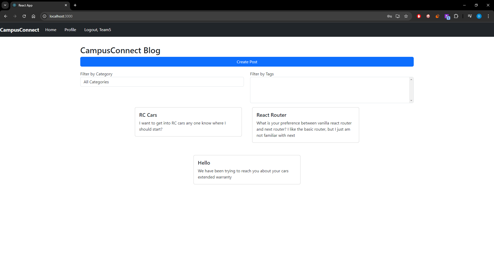
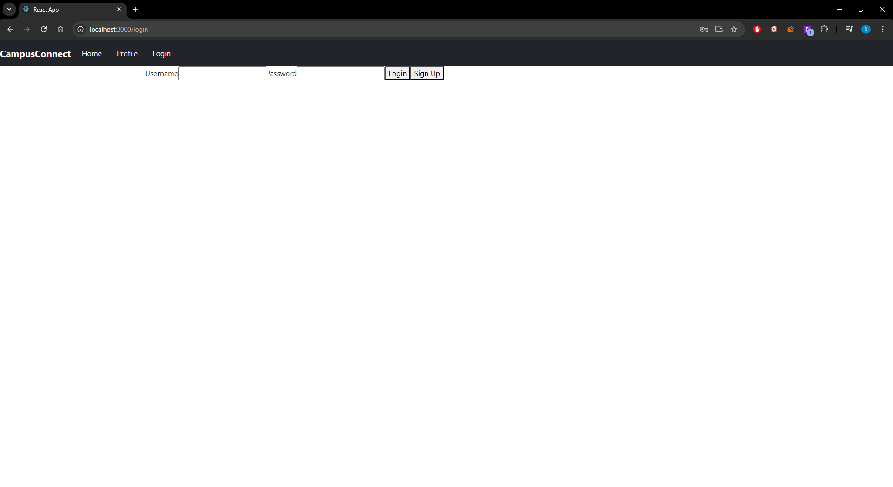
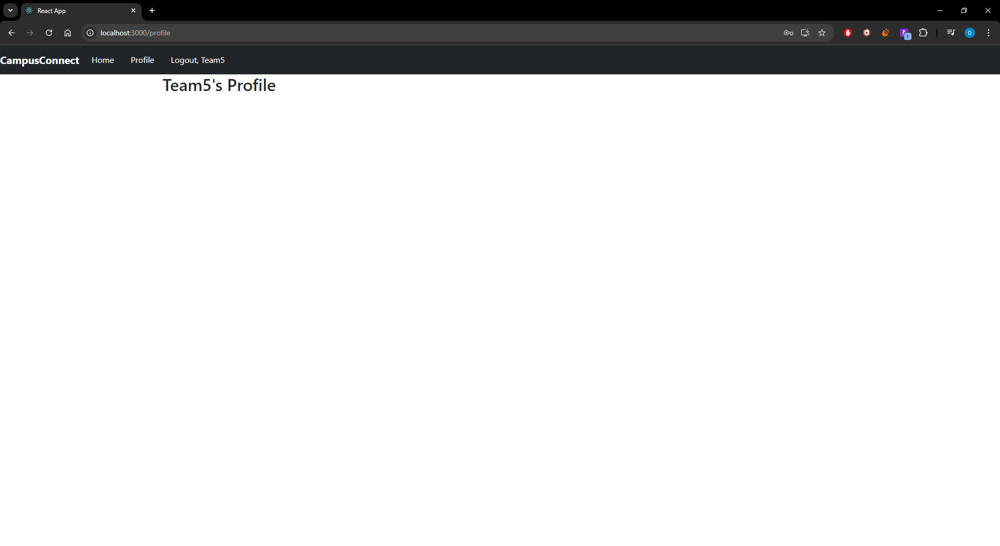
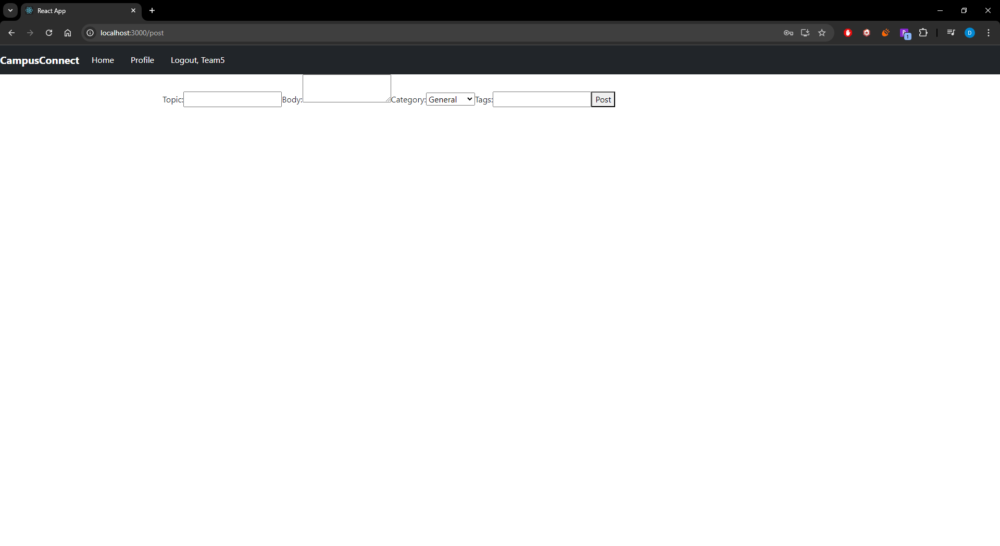

## Home Page (Logged in)
 
Home Page when a user is logged in (Can see all users posts and Navigation)

## Home Page (Not Logged in)
 
Home Page when no one is logged in (Can still see users posts and Navigation)
Logout becomes login and routes to login page
Profile routes to login page as well

## Login Page (Not Logged in)
 
Can Only Navigate to Login when no one is logged in

## Profile Page (Logged in)
 
Can Only Navigate to Profile when user is logged in

## Create Post Page (Logged in)
 
Can Only Create Posts when user is logged in